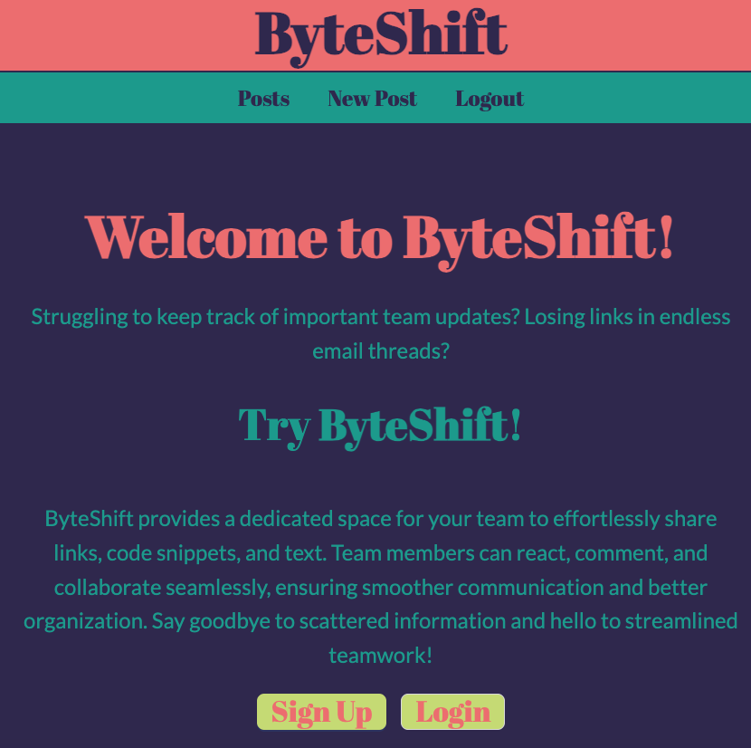
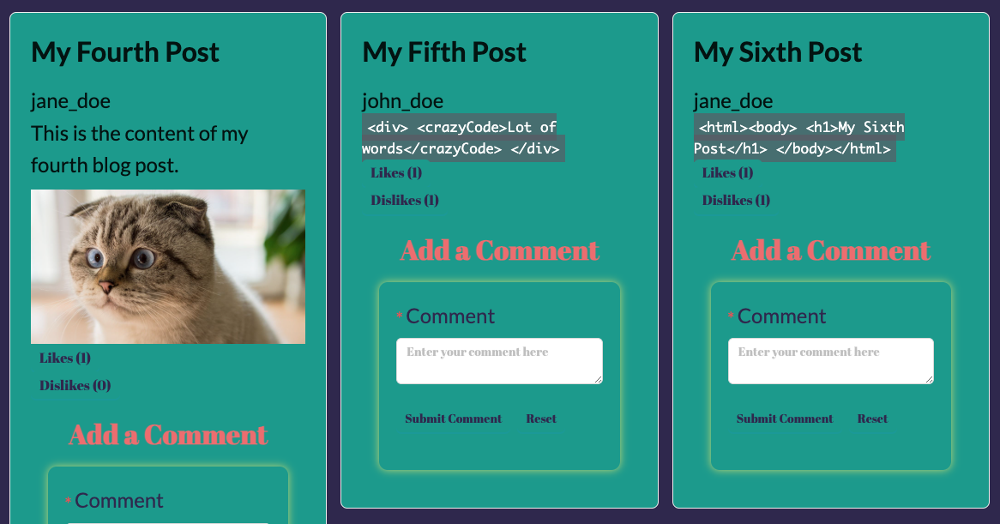
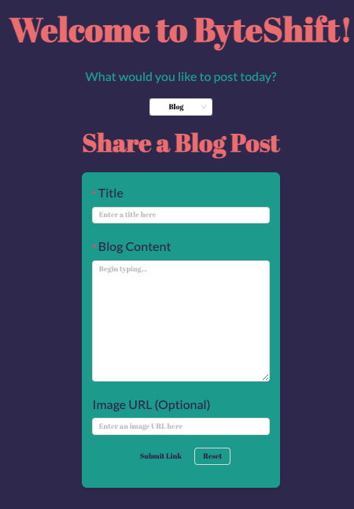

# ByteShift
A team sharing site for the collective sharing of code, articles, and content between members.

## 📚 Description
Struggling to keep track of important team updates? Losing links in endless email threads?

Try <strong>ByteShift</strong>!

ByteShift provides a dedicated space for your team to effortlessly share links, code snippets, and text. Team members can react, comment, and collaborate seamlessly, ensuring smoother communication and better organization. Say goodbye to scattered information and hello to streamlined teamwork!

[Deployed Application](link here) 

## 🚀 Table of Contents
  * [Usage](#📝-Usage)
  * [Features](#⭐-features)
  * [Credits](#🫱🏽‍🫲🏾-credits)
  * [License](#📃-license)
  * [Contact](#🗨️-contact)

## 📝 Usage
<strong>ByteShift </strong>

Here are screenshots of the appilcation ByteShift 

<u><strong>Signup/Login Page</strong></u>

<u><strong>Display Page</strong></u>

<u><strong>New Post Form</strong></u>

Back to [Table-of-Contents](#🚀-table-of-contents)

## ⭐ Features

  * Authentication Wall for Protection
  * Code, Text, and Link Posting Options
  * Commenting and Response Interaction

Back to [Table-of-Contents](#🚀-table-of-contents)

## 🫱🏽‍🫲🏾 Credits

For CI/CD purposes, GitHub Actions were used.

[GitHub Actions](https://github.com/features/actions)

This application was created to require the use of Express.js, MongoDB database, and Mongoose ODM. 

[MongoDB Docs](https://www.mongodb.com/docs/)

This application uses Ant Design for styling as a component library. 

[Ant Design](https://ant.design/)

Back to [Table-of-Contents](#🚀-table-of-contents)

## 📃 License
This application is unlicensed. 

Back to [Table-of-Contents](#🚀-table-of-contents)

## 🗨️ Contact
  
  <strong>Dan Blaze GitHub:</strong> [GitHub.com/BlazeEMP](https://github.com/BlazeEMP)

  <strong>Steve Ha GitHub:</strong> [GitHub.com/Pizza199](https://github.com/Pizza199)
  
  <strong>Missy Kikta GitHub:</strong> [GitHub.com/MelissaKikta](https://github.com/melissakikta)

Back to [Table-of-Contents](#🚀-table-of-contents)
